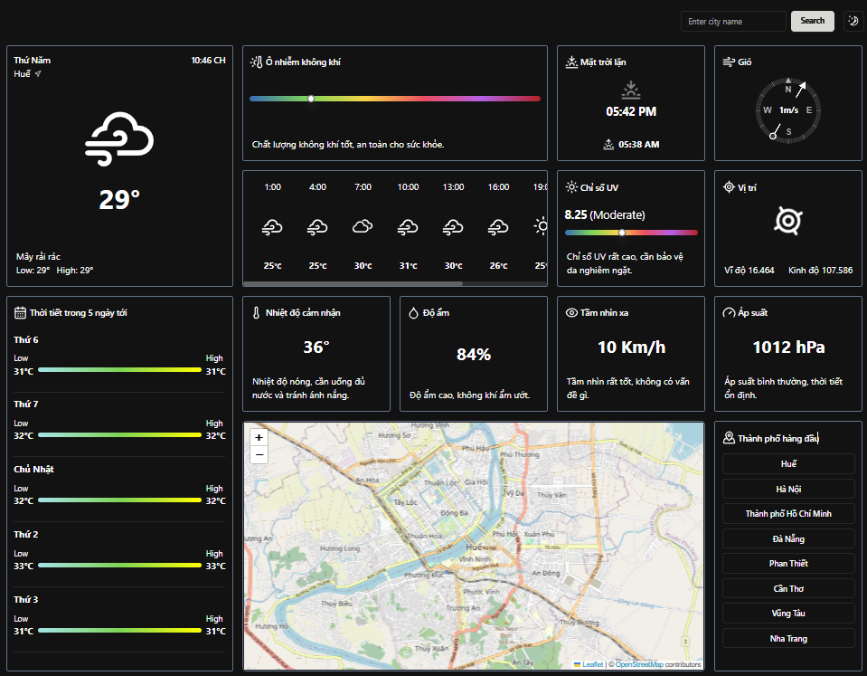

# Weather App

**Weather App** là ứng dụng theo dõi thời tiết được phát triển bằng Next.js, mang đến trải nghiệm người dùng thú vị và trực quan.

Link demo: https://weather-app-five-nu-29.vercel.app

### Giới thiệu

Ứng dụng tích hợp nhiều thư viện hỗ trợ như Shadcn UI, Tailwind, Next Theme và Lucide Icons để tạo ra một giao diện đẹp mắt và phong cách.

_Dự án được phát triển bởi Khánh Nguyên._

## Tính Năng Nổi Bật

-   **Xem thông tin thời tiết theo khu vực**: Tìm kiếm và theo dõi thời tiết tại bất kỳ thành phố nào.
-   **Chủ đề sáng và tối theo thiết bị hoặc tuỳ chỉnh**: Sử dụng next theme cho giao diện.
-   **Thông tin chi tiết bao gồm**:
    -   Nhiệt độ và điều kiện thời tiết hiện tại
    -   Độ ô nhiễm không khí
    -   Dự báo nhiệt độ trong 24 giờ
    -   Thời gian mặt trời mọc
    -   Tốc độ và hướng gió
    -   Chỉ số UV
    -   Tầm nhìn
    -   Hiển thị bản đồ khu vực
    -   Dự báo nhiệt độ trong 5 ngày tới

## Cách Hoạt Động

Ứng dụng sử dụng phương pháp **Server-Side Rendering (SSR)** để lấy dữ liệu thời tiết từ server. Dữ liệu được lấy từ API và truyền trực tiếp đến client mà không cần xử lý loading. Khi người dùng truy cập vào trang, dữ liệu thời tiết sẽ được render ngay lập tức, mang lại trải nghiệm mượt mà và nhanh chóng.

## Công Nghệ Sử Dụng

-   **React 18**
-   **Next.js 14.2.11**
-   **Tailwind CSS**
-   **Shadcn UI**
-   **Lucide Icons**
-   **TypeScript**
-   **Next Theme**

## Hình Ảnh Minh Họa với chế độ ban đêm

**Trang chính**  


## Hướng Dẫn Cài Đặt

Để sử dụng ứng dụng cục bộ, bạn có thể làm theo các bước sau:

```bash
npm install
yarn dev
```
-   File .env được công khai để sử dụng

## Liên hệ

-   Mọi phản hồi liên hệ đến Khánh Nguyên
  

    Hoàn thành 26/9/2024

_Cảm ơn bạn đã xem qua Chat App! Chúng tôi hy vọng bạn thấy nó hữu ích và thú vị. Chúc bạn lập trình vui vẻ!_
